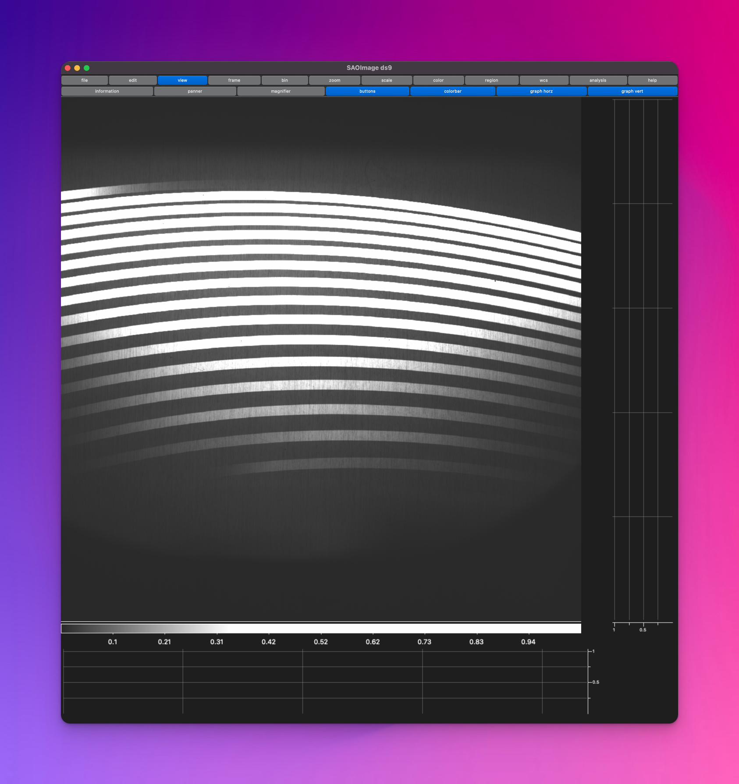
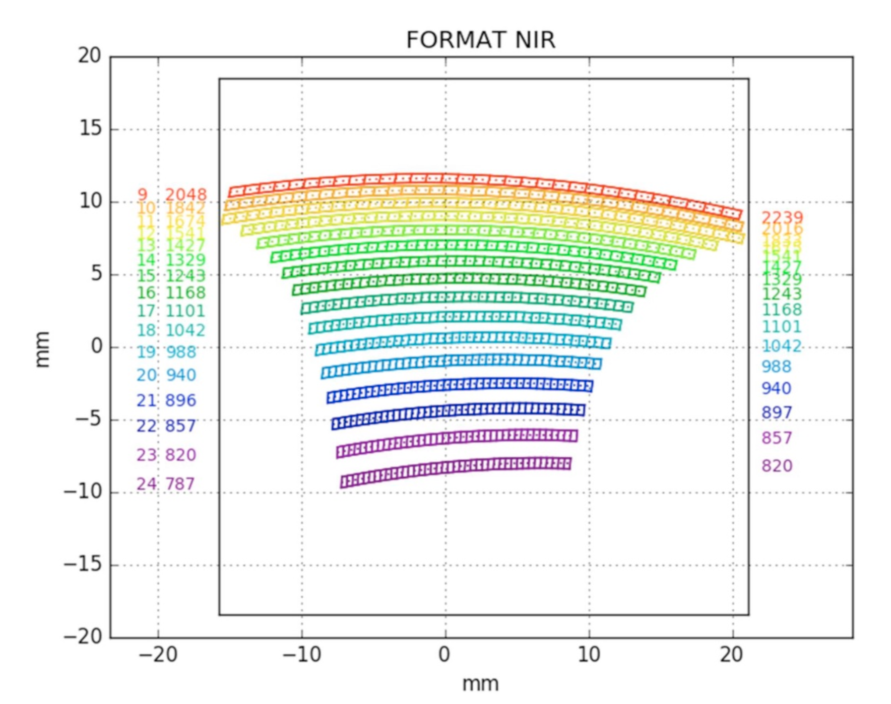

## NIR Spectrograph

:::{table} SOXS NIR Spectrograph/Array Characteristics

| Parameter                   | Value                                                        |
| --------------------------- | :----------------------------------------------------------- |
| Detector                    | Teledyne H2RG                                                |
| Pixel-Size                  | 18 μm                                                        |
| Array-Size                  | 2048 $\times$ 2048 px                                        |
| Array-Scale                 | 0.25 arcsec/px                                               |
| Read noise (RMS)            | Double correlated: $< 20 e^{-}$   16 Fowler pairs $< 7 e^{-}$ |
| Dark current @ 40K          | $< 0.005 {e^{-}/s/px}$                                       |
| Resolution $(R)$            | $\simeq$ 5000 (1 arcsec slit)                                |
| Wavelength Range            | 800-2000 nm                                                  |
| Slit Widths                 | 0.5, 1.0, 1.5, 5.0 arcsec                                    |
| Slit Height                 | 12 arcsec                                                    |
| Grating Blaze Angle         | 44°                                                          |
| Detector Operating Temp     | 40K                                                          |
| Spectrograph Operating Temp | 150K                                                         |
| Orders                      | 15                                                           |
| Penrays                     | Ar-Ne-Xe-Hg                                                  |

:::

As described in {cite:t}`vitali2018b`, the SOXS NIR spectrograph is a near-infrared, cross-dispersed echelle spectrograph, with $R=5000$ (for a one-arcsec slit). It employs '4C' (Collimator Correction of Camera Chromatism) to cover a wavelength range from 800 to 2050nm over 15 orders. This wavelength range provides a 50nm overlap with the SOXS UV-VIS arm for cross-calibration. 

As with the UV-VIS, four slits options ($0.5$, $1$, $1.5$ and $5$ arcsec) are provided, which will project a FWHM for an unresolved spectral line onto four detector pixels. A slit height of 12 arcsecs is employed. The detector is a $2k\times2k$ 18-micron pixel Teledyne H2RG TM array. As atmosphere dispersion is less severe in the NIR regime, unlike the UV-VIS arm, the NIR arm does include an atmosphere dispersion corrector (ADC). 

:::{figure-md}
{width=600px}

A SOXS flat-lamp calibration image.
:::

:::{figure-md}
{width=600px}

The SOXS NIR spectral format, Figure 5 of {cite:t}`vitali2018b`. The inter-order gap is always >10px.
:::

:::{bibliography}
:filter: docname in docnames
:::
