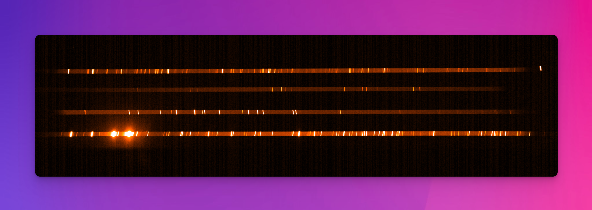

## UVVIS Spectrograph

:::{table} SOXS UV-VIS Spectrograph/CCD Characteristics

| Parameter           | Value                                                        |
| ------------------- | ------------------------------------------------------------ |
| Detector            | e2V CCD44-82                                                 |
| Pixel-Size          | 15 μm                                                        |
| Array-Size          | 2048 $\times$ 4096 px; 30.7 x 61.4 mm                        |
| Array-Scale         | 0.28 arcsec/px                                               |
| Peak Signal         | 200,000 $e^{-}/px$                                           |
| Gain                | Slow: 0.6 $\pm$ 0.1  $e^{-}/ADU$   Fast: 2 $\pm$ 0.2 $e^{-}/ADU$ |
| Read noise (rms)    | Slow: <3 $e^{-}$  Fast: <8 $e^{-}$                        |
| Dark current @ 153K | < 0.00001$e^{-}/s/px$                                        |
| Resolution ($R$)    | 3500-7000 ($\simeq$ 4500 mean)                               |
| Wavelength Range    | 350-850nm                                                    |
| Slit Widths         | 0.5, 1.0, 1.5, 5.0 arcsec                                    |
| Slit Height         | 11 arcsec                                                    |
| Grating Blaze Angle | 41°                                                          |
| Orders (quasi)      | 4                                                            |

:::

As shown in {numref}`uvis_format`, the SOXS UV-VIS arm has four dispersing elements, each of which produces a dispersed beam, or pseudo-order (u, g, r, i), which are then all imaged onto the 4k x 2k e2v CCD44-82 device (15$\mu$m pixels).  Unlike a typical echelle spectrograph, no order curvature exists for any of these four orders {cite:p}`{see}cosentino2018,sanchez2018a,rubin2020`. The straight orders do not align precisely along a detector row but are tilted in the dispersion direction by a few pixels. As with the NIR, the slit height in $12''$.

:::{figure-md} uvis_format
:target: ../_images/image-20240902153453725.png
{width=600px}

SOXS UV-VIS spectral format, Figure 4 of {cite:t}`sanchez2018a` modified to show the dispersion direction for each pseudo-order.

:::

The object trace in these orders is straight, but the skylines are not perpendicular to the object spectrum but are tilted in the cross-dispersion direction (see {numref}`uvis_xenon`).

The full UV-VIS wavelength range is 350 – 850nm (providing a 50nm overlap with the NIR arm for cross-calibration), and with the deep-depleted CCD42-82 device, fringing in the red part of the spectrum is below $5\%$ and, therefore, the pipeline does not perform any fringing corrections. Also, due to the CCD's low dark current, calibration dark frames are not required. Unlike the NIR arm, the UV-VIS arm *will* include an ADC.

:::{figure-md} uvis_xenon
:target: ../_images/image-20240903112402170.png
{width=600px}

A SOXS UV-VIS Xenon arc lamp frame. The arc lines are not perpendicular to the dispersion axis, but tilted in the cross-dispersion direction.

:::

:::{bibliography}
:filter: docname in docnames
:::
