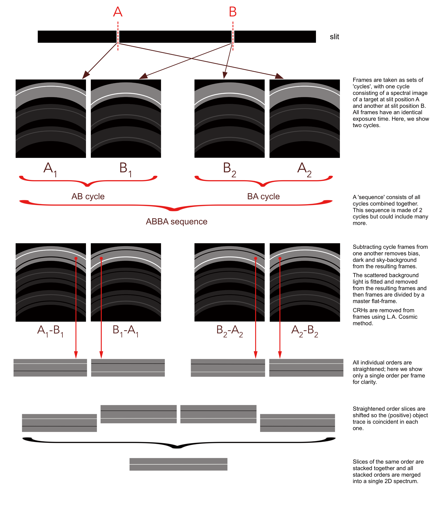

# Observing Modes

## Spectroscopic Observing Modes

The glow of thermal emission from the earth's atmosphere, and even the telescope itself, starts to dominate photon counts at NIR wavelengths, seriously contaminating the signal from target sources. This thermal emission glow is typically dubbed 'sky background' (even though it originates in the foreground of the target source).

SOXS has multiple observation modes to provide astronomers with flexibility and a choice of methods to isolate and remove the noise generated by the sky background from their science frames.

The three main spectroscopic observation modes are (click links for more detail):

1. Stare mode is a simple 'point and shoot' observation with simultaneous UV-VIS and NIR exposures. With stare mode observations, the on-source sky background is modelled, fitted, and removed with software. Although background removal is less accurate than the other observation modes, the time lost in overheads is lower. Also, unlike the other observation modes, the need for image subtraction, which increases the random noise in the data by $\sqrt{2}$, is bypassed. Multiple exposures of the target can be taken, and combined exposures help remove cosmic ray hits and avoid saturation of skylines.
2. Nodding mode employs an observational technique to measure the sky background of an empty patch of sky near in time and spatially close to the source. This spectral measurement of the sky background flux is removed from the on-source spectrum. Although generating more overhead time than stare mode, unlike offset mode, this technique allows the source and sky to be observed on the same frames.
3. Offset mode employs the same essential 'observe and subtract' method to remove the sky background as nodding mode but is typically favoured for extended sources where it is not possible to observe a blank patch of sky and the source within the same 12 arcsec slit. As the sky and source are observed in separate frames, this observation mode has the highest fraction of time lost to overheads.

### More on Nodding and Offset Modes

The driving motivation for observing with nodding or offset mode over stare mode is to isolate the target flux more accurately by providing a cleaner sky background subtraction. 

To ensure a clean subtraction, we need a spectral image of the night sky closely resembling the profile of the sky, contributing to flux in the target image. As sky flux varies on a timescale of minutes, ideally, we would observe a relatively empty area of the night sky as close as possible to our target source in both space and time. The 'nodding' observational technique was designed to fulfil these criteria.

:::{figure-md} nodding_diagram

The nodding method of sky-subtraction. Offset mode works in much the same way, except the sky and source are observed in separate frames.

:::

#### Cycles and Sequences

During nodding-observations we consider 2 locations on the slit, A and B, separated by a few arcseconds. Observations are performed in pairs of equal length exposures called *cycles*. First a spectrum is taken with the target located at slit-position A. The telescope is then shifted, or 'nodded', so the target is at slit-position B and a second spectrum is taken. This completes an `AB` *cycle*. This process is then repeated in reverse to acquire the third and forth exposures at slit-positions B and A respectively; a `BA` cycle. 

Two or more cycles are then combined into a *sequence*. The shortest sequence possible is `AB` and `BA`, or `ABBA`, but sequences can be compiled by many cycles. e.g. an 8 cycle sequence `ABBAABBAABBAABBA`.

#### Jittering

Alongside nodding it is also possible to introduce *jittering* which allows for the target to be shifted by a very small random offset each time it is placed at slit positions A and B. This jittering helps avoid the case where the same portion of a target spectrum may be masked by bad-pixels/columns on the detectors.

When including jitter an `ABBA` sequence becomes A$^{1}$ B$^{1}$ B$^{2}$ A$^{2}$ , where the subscript indicates a location at the slit-positions A or B but now including a small random offset (a jitter).

#### Combining Frames

For each cycle exposure pair, 2 difference images are produced; `A-B` and `B-A`. Each difference image will contain a trace of the target with the sky-background removed (and also a trace of the sky-background with the target flux removed). For all difference images, each echelle order can be identified and straightened (rectified)  into its own image. Then for each set of order images, the target trace can be aligned and images combined to improve the signal-to-noise ratio in a final stacked image.

Offset mode works in much the same way as nodding, except the sky and source are observed in separate frames.

