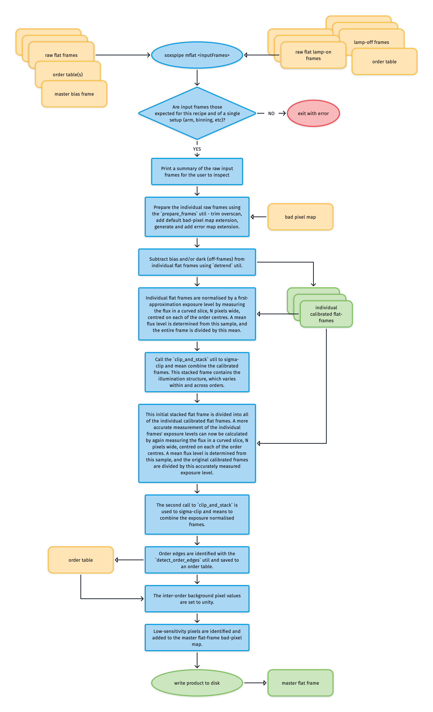

# `soxs_mflat`

The purpose of the [`soxs_mflat`](../_api/soxspipe.recipes.soxs_mflat.html) recipe is to create a single normalised [master-flat frame](../files/master_flat.md) used to correct for non-uniformity in response to light across the detector plain.
 
Sources of this non-uniformity include varying pixel sensitivities, obstructions in the optical path (e.g. dust or pollen grains), vignetting at the edges of the detector. A flat-frame is ideally an image taken where the illumination is uniform across the light collecting pixels of the detector. This evenly exposed image can be used to identify irregularities in the response in the detector.

### Input

<! -- FIND OBs HERE : https://docs.google.com/spreadsheets/d/1-3VXkIWcydvpawwVl_C3pNTU3HgnElJaYFAKow65Fl8/edit#gid=0 -->

| Data Type | Content | Related OB |
|:----|:----|:---|
| FITS images | raw flats frames (exposures with identical exposure time and detectors readout parameters) | `SOXS_slt_cal_NIRLampFlat`, `SOXS_slt_cal_NIRLampFlatAtt`, `SOXS_slt_cal_VISLampFlat`, `SOXS_slt_cal_VISLampFlatAtt` |
| CSV File | [order table](../files/order_table.md) containing coefficients to the polynomial fits describing the order centre locations |

### Parameters

| Parameter                | Description                                   | Type  | Entry Point   | Related Util                                   |
| ------------------------ | --------------------------------------------- | ----- | ------------- | ---------------------------------------------- |
| clipping-lower-sigma     | number of σ below which a pixel is clipped    | float | settings file | [`clip_and_stack`](../utils/clip_and_stack.md) |
| clipping-upper-sigma     | number of σ above which a pixel is clipped    | float | settings file | [`clip_and_stack`](../utils/clip_and_stack.md) |
| clipping-iteration-count | number of sigma-clipping iteration to perform | int   | settings file | [`clip_and_stack`](../utils/clip_and_stack.md) |
| centre-order-window | the width of the slice to cut along the centre of each order when determining mean pixel value | int | settings file |   |
| slice-length-for-edge-detection | length of image slice to take across orders when detecting edges | int | settings file |[`detect_order_edges`](../utils/detect_order_edges.md) |
| slice-width-for-edge-detection | width of image slice to take across orders when detecting edges | int | settings file |[`detect_order_edges`](../utils/detect_order_edges.md) |
| min-percentage-threshold-for-edge-detection | minimum value flux can drop to as percentage of central flux and be counted as an order edge | int |settings file | [`detect_order_edges`](../utils/detect_order_edges.md) |
| max-percentage-threshold-for-edge-detection | minimum value flux can claim to as percentage of central flux and be counted as an order edge | int | settings file | [`detect_order_edges`](../utils/detect_order_edges.md) |
| poly-deg | the order of polynomial to use when fitting order edges | int | settings file | [`detect_order_edges`](../utils/detect_order_edges.md) |
| poly-fitting-residual-clipping-sigma | sigma deviation threshold used for clipping when iterating towards a fit of order edges | int | settings file | [`detect_order_edges`](../utils/detect_order_edges.md) |

### Method



The individual flat field frames need to have bias and dark signatures removed before they are combined. This is achieved with the [`subtract_calibrations`](../utils/subtract_calibrations.md) utility. Here is an example of one such calibrated flat frame:

[](https://live.staticflickr.com/65535/51237891523_cc24b22ba7_b.jpg)

#### Normalising Exposure Levels in Individual Flat Frames

Once calibrated, exposure-levels in the individual flat frames need to be normalised as *total* illumination will vary from frame-to-frame. The of individual frame exposure levels are calculated in two stages.

In the first stage the mean inner-order pixel-value across the frame is used as a *first approximation* of an individual frame's exposure level. To calculate this mean value, the order locations are used to identify a curved slice N-pixels wide centred on each of the order-centres and bad pixels are masked (see image below). The collected inner order pixel values are then sigma-clipped to excluded out-lying values and a mean value calculated.

[](https://live.staticflickr.com/65535/51237856613_da50864d52_b.jpg)

Individual frames are then divided through by their mean inner-order pixel value in this first attempt to normalise the exposure-levels of the frames. 

[](https://live.staticflickr.com/65535/51238466119_6844cce08b_b.jpg)

The normalised flat-frames are then combined using the [`clip_and_stack`](../utils/clip_and_stack/.md) utility into a first-pass master-flat frame:

[](https://live.staticflickr.com/65535/51237081792_6090fe56df_b.jpg)

The second stage then is to divide each original dark and bias subtracted flat frame by this first-pass master flat (see example below). This removes the *typical* cross-plane illumination and so now the mean inner-order pixel-value across the frame will give a much better estimate of each frame's intrinsic exposure level.

[](https://live.staticflickr.com/65535/51237134772_bf081c62cc_b.jpg)

The mean inner-order pixel-value is calculated again on this frame and the original dark and bias subtracted flat is re-normalised by divided through by this accurate measurement of its intrinsic exposure level.

[](https://live.staticflickr.com/65535/51237233602_c3c96b3503_b.jpg)

#### Building a Final Master-Flat Frame

These re-normalised flats are then combined for a second time into a master-flat frame.

[](https://live.staticflickr.com/65535/51237949461_0bc4763a06_b.jpg)

As a last step, the scattered background light is fitted and removed from the frame using the [`subtract_background`](../utils/subtract_background.md) utility to produce the final master-flat frame.

[](https://live.staticflickr.com/65535/51239008475_b7c0aa33c7_b.jpg)


### Output
 
| Data Type | Content |
|:----|:----|
| master flat frame |  frame used correct for non-uniformity in response to light across the detector plain (including blaze) |

### QC Metrics

| Metric  | Description |
| :------------ | :----------- |
| TBC     | ...  |

### Recipe API

```eval_rst
.. autoclass:: soxspipe.recipes.soxs_mflat
    :members:
```
