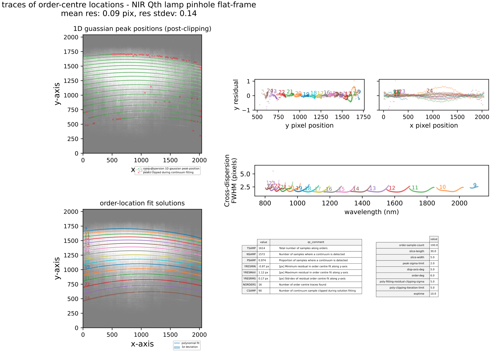

# soxs_order_centres

:::{include} ./descriptions/soxs_order_centres.inc
:::

## Input

:::{include} ./inputs/soxs_order_centres.inc
:::

:::{include} ./static_files/soxs_order_centres.inc
:::

## Parameters

:::{include} parameters/soxs_order_centres.inc
:::

## Method

The algorithm used in the `soxs_order_centres` recipe is shown in {numref}`soxs_order_centres_diagram`.

Once the single-pinhole flat-lamp frame has had the bias, dark and background subtracted it is passed to the [detect_continuum utility](../utils/detect_continuum.md) to fit the order centres.

:::{figure-md} soxs_order_centres_diagram
{width=600px}

The `soxs_order_centres` recipe algorithm. At the top of the diagram, NIR input data is found on the right and VIS on the left. 
:::

## Output

:::{include} output/soxs_order_centres.inc
:::

## QC Metrics

:::{include} qcs/soxs_order_centres.inc
:::

Plots similar to the one below are generated after each execution of [`soxs_order_centres`](#soxspipe.recipes.soxs_order_centres). The residuals of a 'good' fit typically have a mean and standard deviation <0.2px.

:::{figure-md} soxs_order_centres_qc
{width=601px}

A QC plot resulting from the `soxs_order_centres` recipe as run on a SOXS NIR single pinhole QTH flat lamp frame. The top-left panel shows the frame with green circles representing the locations on the cross-dispersion slices where a flux peak was detected. The red crosses show the centre of the slices where a peak failed to be detected. The bottom-left panel shows the global polynomial fitted to the detected order-centre trace with the different colours representing individual echelle orders. The top-right panels show the fit residuals in the X and Y axes. The bottom-right panel shows the FWHM of the trace fits (in pixels) with respect to echelle order and wavelength.

:::

## Recipe API

:::{autodoc2-object} soxspipe.recipes.soxs_order_centres.soxs_order_centres
:::
