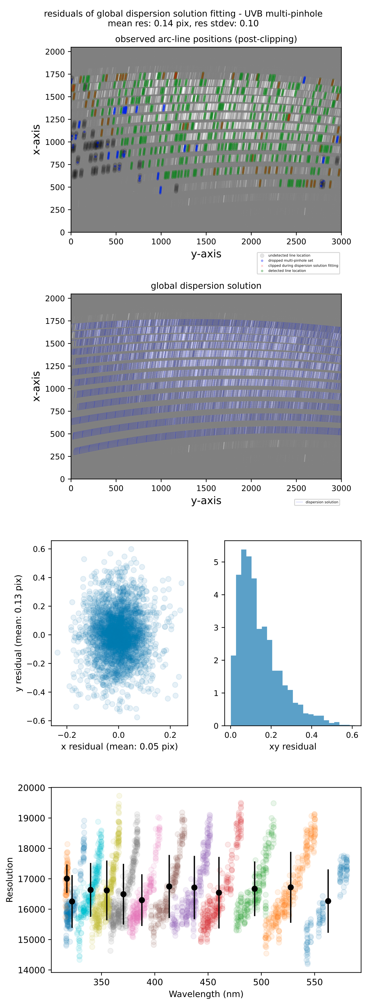

# soxs_spatial_solution

The ` soxs_spatial_solution` recipe enhances the wavelength solution achieved with [`soxs_disp_solution`](../recipes/soxs_disp_solution.md) by expanding the solution into the spatial dimension (along the slit). The resulting 2-dimensional solution accounts for any tilt in the spectral lines relative to the cross-dispersion axis. The recipe is similar in logic to [`soxs_disp_solution`](../recipes/soxs_disp_solution.md), but now samples arc lines along the slit in the cross-dispersion direction using a multi-pinhole slit mask.

## Input

:::{include} inputs/soxs_spatial_solution.md
:::

## Parameters

:::{include} parameters/soxs_spatial_solution.md
:::

## Method

The algorithm used in the `soxs_spatial_solution` recipe is shown in {numref}`soxs_spatial_solution_diagram`.

Having [prepared](../utils/prepare_frames.md) the multi-pinhole frame, the [bias and dark signatures are removed](../utils/detrend.md), and the frame is divided through by the master flat frame. The calibrated frame and the first-guess dispersion map are passed to the [`create_dispersion_map`](../utils/create_dispersion_map.md) utility to produce a 2D dispersion solution covering both the spectral and spatial dimensions.

A three-extension FITS image with the same format as the detector is created using the complete dispersion solution. The first extension contains the wavelength values for each pixel, the second the slit positions, and the third the echelle order number.

:::{figure-md} soxs_spatial_solution_diagram
:target: soxs_spatial_solution.png
{width=600px}

The `soxs_spatial_solution` recipe algorithm.
:::

## Output

:::{include} output/soxs_spatial_solution.md
:::

## QC Metrics

:::{figure-md} soxs_spatial_solution_qc
:target: ../_images/image-20240924143842700.png
{width=600px}

A QC plot resulting from the `soxs_spatial_solution` recipe. The top panel shows an Xshooter VIS arc-lamp frame, taken with a multi-pinhole mask. The green circles represent arc lines detected in the image, and the blue circles and red crosses are lines that were detected but dropped as other pinholes of the same arc line failed to be detected or the lines were clipped during the polynomial fitting. The grey circles represent arc lines reported in the static calibration table that failed to be detected on the image. The second panel shows the same arc-lamp frame with the dispersion solution overlaid as a blue grid. Lines travelling along the dispersion axis (left to right) are lines of equal slit position, and lines travelling in the cross-dispersion direction (top to bottom) are lines of equal wavelength. The third panel shows the residuals of the dispersion solution fit, and the final panel shows the resolution measured for each line (as projected through the pinhole mask) with different colours for each echelle order and the mean order resolution in black.
:::

:::{include} qcs/soxs_spatial_solution.md
:::

## Recipe API

:::{autodoc2-object} soxspipe.recipes.soxs_spatial_solution.soxs_spatial_solution
:::
