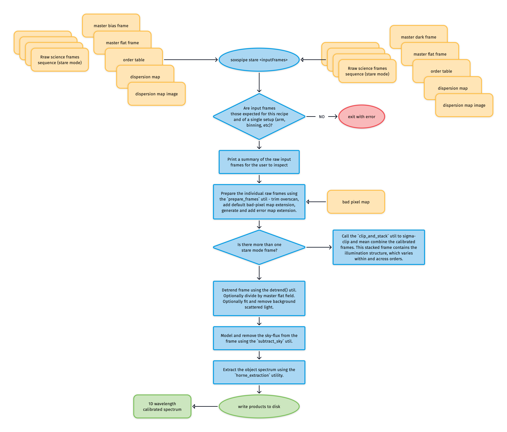

# soxs_stare

:::{include} ./descriptions/soxs_stare.inc
:::

## Input

:::{include} ./inputs/soxs_stare.inc
:::

:::{include} ./static_files/soxs_stare.inc
:::

## Parameters

:::{include} parameters/soxs_stare.inc
:::

## Method

The algorithm used in the `soxs_stare` recipe is shown in {numref}`soxs_stare_diagram`.

:::{figure-md} soxs_stare_diagram
{width=600px}

The `soxs_stare` recipe algorithm. At the top of the diagram, NIR input data is found on the right and VIS on the left. 
:::

If more than one stare mode frame is passed to the `soxs_stare` recipe, there is a call to [`clip_and_stack`](../utils/clip_and_stack.md) to combine the data into a single frame. The single stare-mode frame is detrended using the [`detrend`](../utils/detrend.md), optionally dividing by a master flat field and fitting and removing the background scattered light. The sky-flux is modelled and removed using the `subtract_sky` util, and finally, the object is optimally extracted using the [`horne_extraction`](../utils/horne_extraction.md) utility.

Note a boxcar extraction is also preformed alongside the Horne extraction. Use the `horne-extraction-slit-length` to control the size of the aperture used to preform the boxcar extraction on the object trace.

## Output

:::{include} output/soxs_stare.inc
:::

## QC Metrics

:::{include} qcs/soxs_stare.inc
:::

## Recipe API

:::{autodoc2-object} soxspipe.recipes.soxs_stare.soxs_stare
:::
