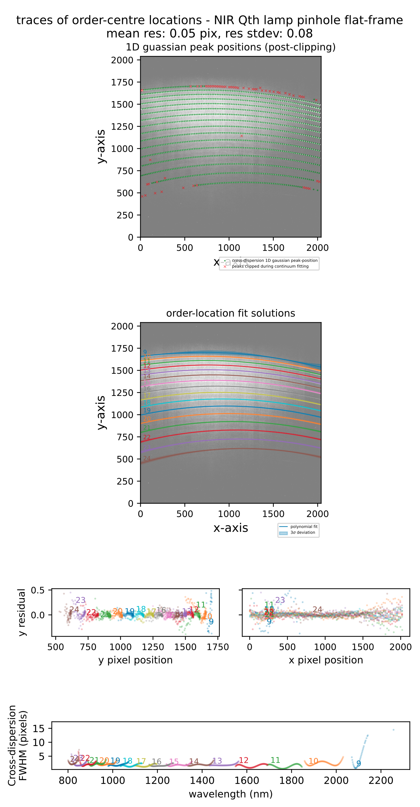

## soxs_order_centres

The [`soxs_order_centres`](../../../recipes/soxs_order_centres.md) recipe can be run with the following convention:

```bash
soxspipe [-Vx] order_centres <inputFrames> [-o <outputDirectory> -s <pathToSettingsFile> --poly=<ooww>]
```

To rerun a previously executed `soxs_order_centres` recipe, you can find the execution command at the end of the [recipe log file](../../logging.md) (found in the workspace `products/soxs_order_centres` directory). Use the `-x` flag to overwrite the product files if they already exist. For example, from the root of your workspace, you would run a command like:

```bash
soxspipe order_centres sof/2019.10.31T10.02.46.516_UVB_1X1_FAST_ORDER_LOCATIONS_QLAMP_UVB_HIGH_30.0S_XSHOOTER.sof -s ./sessions/base/soxspipe.yaml 
```

To adjust the default settings for the `soxs_order_centres` recipe, open the `soxspipe.yaml` file referenced in the command above in a text editor, navigate to the `soxs_order_centres` dictionary, save the file and rerun the recipe command. The settings' descriptions can be found in {numref}`soxs_order_centres_parameters`.

:::{include} ../../../recipes/parameters/soxs_order_centres.md
:::

Product files are written in the `products/soxs_order_centres`, and QC plots are in the `qc/soxs_order_centres` workspace directory. A report of the product files, QC plots and metrics is also printed to the terminal. The QC metrics calculated for `soxs_order_centres` are found in {numref}`soxs_order_centres_qc` and a typical QC plot in {numref}`soxs_order_centres_qc_fig`.

:::{include} ../../../recipes/qcs/soxs_order_centres.md
:::

:::{figure-md} soxs_order_centres_qc_fig
{width=600px}

A QC plot resulting from the `soxs_order_centres` recipe as run on an SOXS NIR single pinhole QTH flat lamp frame. The top panel show the frame with green circles represent the locations on the cross-dispersion slices where a flux peak was detected. The red crosses show the centre of the slices where a peak failed to be detected. The second panel show the global polynomial fitted to the detected order-centre trace with the different colours representing individual echelle orders. The third row of panels show the fit residuals in the X and Y axes. The bottom panel shows the FWHM of the trace fits (in pixels) with respect to echelle order and wavelength.
:::

