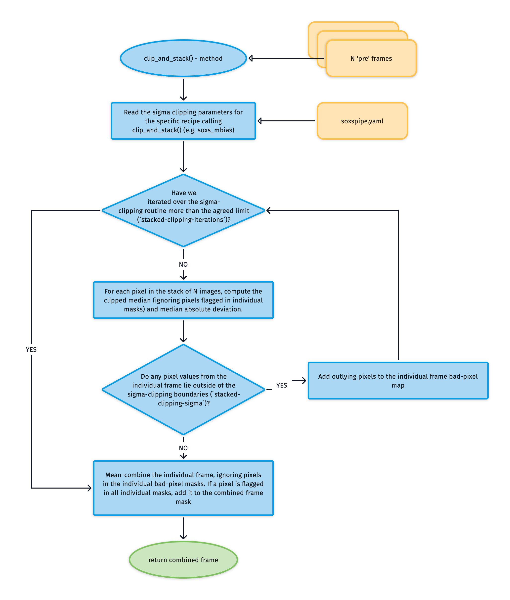

# clip_and_stack

The purpose of the [`clip_and_stack`](#soxspipe.recipes.base_recipe.base_recipe.clip_and_stack) utility is to combine a set of input images into a single master frame.

Before combining the frames, any outlying pixel values found in the individual frames to be stacked are 'clipped'. These outlying pixels are identified as those with a value straying too far (defined by the recipe parameter `stacked-clipping-sigma`) from the 'typical' pixel value.

Using the median pixel value as the 'typical' value and the *median absolute deviation* (MAD) as a proxy for the standard deviation, we can accurately identify rogue pixels. For any given set of pixel values:

$$
MAD = \frac{1}{N}\sum_{i=0}^N |x_i - \text{median}(x)|.
$$

The clipping is done iteratively so newly found deviant pixels are masked, median values are recalculated and clipping repeated. The iterative process stops whenever either no more bad-pixels are to be found or the maximum number of iterations has been reached (defined by the recipe parameter `stacked-clipping-iterations`).

After the clipping has been completed individual frames are mean-combined, ignoring pixels in the individual bad-pixel masks. If a pixel is flagged as 'bad' in all individual masks it is added to the combined frame bad-pixel mask.

:::{figure-md} clip_and_stack_util
:target: clip_and_stack.png
{width=600px}

The algorithm used whenever a set of images is to be combined into a single master frame. This utility is used repeatedly throughout the pipeline.
:::

## Utility API

:::{autodoc2-object} soxspipe.recipes.base_recipe.base_recipe.clip_and_stack
:::
