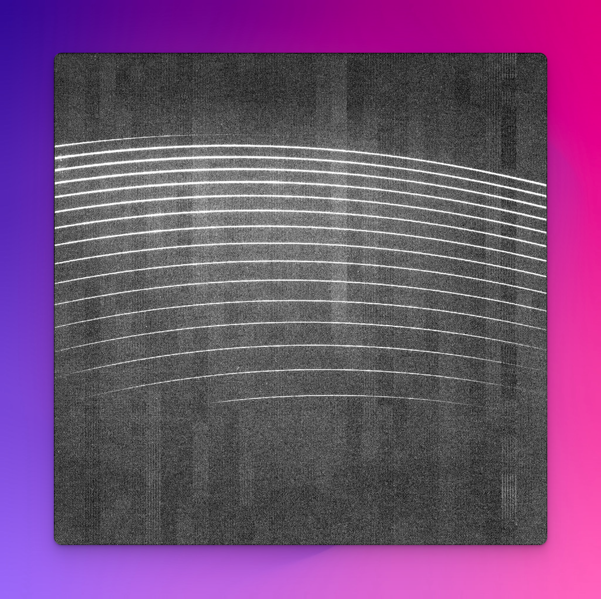
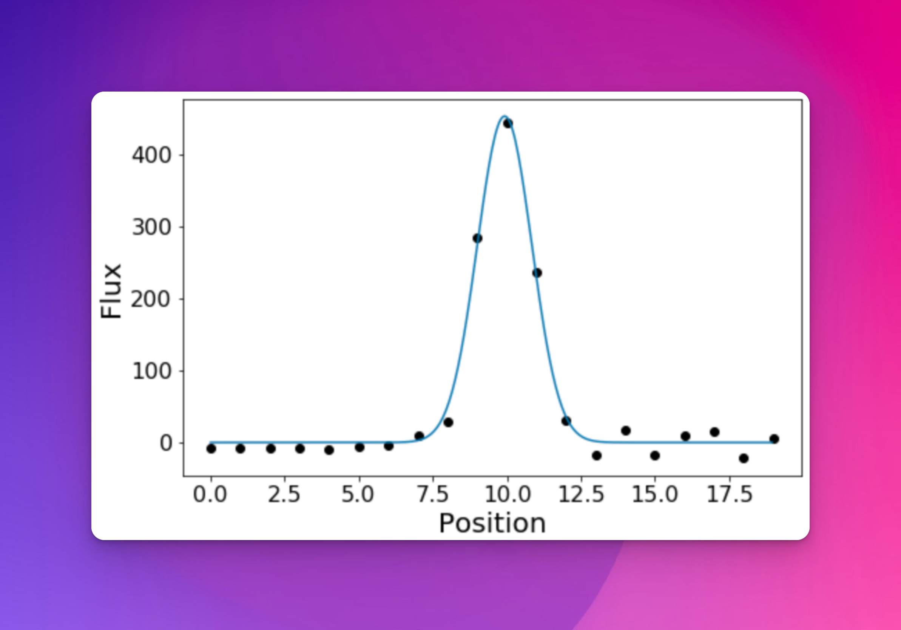
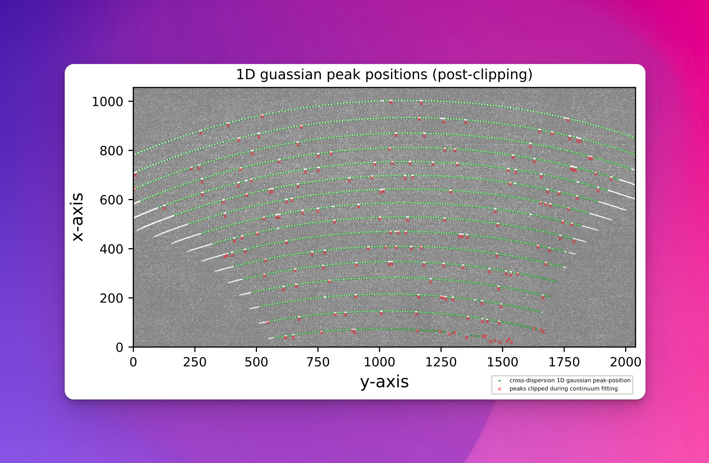
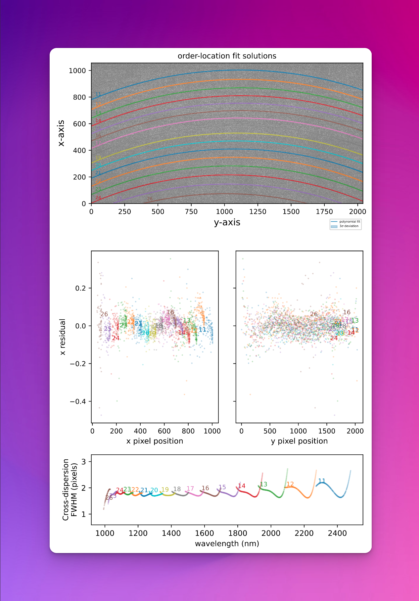

# detect_continuum

The `detect_continuum` utility locates and fits a trace using a low-level polynomial across all echelle orders.

:::{figure-md} detect_continuum_util
:target: detect_continuum.png
{width=600px}

The algorithm used to fit a source trace across all the echelle orders.
:::

The [`detect_continuum`](#soxspipe.commonutils.detect_continuum) utility takes an image frame containing a source trace as input. This trace could be from a calibration lamp (as used in the [`soxs-order-centres`](../recipes/soxs_order_centres.md) recipe, see {numref}`pinhole-flat-image`) or an astrophysical object; the algorithm to fit the trace is the same.

:::{figure-md} pinhole-flat-image
:target: ../_images/image-20240910162534830.png
{width=600px}

A 15-second QTH flat-lamp exposure through a pinhole mask onto the SOXS NIR detector.
:::

From a [spectral format table](../files/spectral_format_table.md) (specific to the arm in question), the minimum and maximum wavelength values for each order are known. The [first guess dispersion map](../files/dispersion_map.md) generated by [`soxs_disp_solution`](../recipes/soxs_disp_solution.md) generates an array of pixel locations along the centre of each order between these wavelength limits.

Centred on each pixel position, an N-pixel long (`slice-length` recipe parameter), M-pixel wide (`slice-width` recipe parameter) image slice is taken in the cross-dispersion direction. Each slice is collapsed to 1 pixel in width by taking the median pixel value at each location along the length of the slice. A 1D gaussian is fitted to the flux in each slice, and if a peak is registered with more than a `peak-sigma-limit` sigma significance, the pixel-position is stored (see {numref}`gaussian-fitting` and {numref}`peak-fits`).

:::{figure-md} gaussian-fitting
:target: ../_images/image-20240910165703002.png_

An attempt is made to fit a Gaussian to the flux in each slice. The pixel position is stored if a peak is registered with more than a `peak-sigma-limit` sigma significance.
:::

:::{figure-md} peak-fits
:target: ../_images/image-20240910170025287.png

The green circles represent the location on the cross-dispersion slice where a flux peak was detected. The red crosses show the centre of the slices where a peak failed to be detected.
:::

Finally, the entire set of Gaussian peak pixel positions is iteratively fitted with a polynomial:

$$
X = \sum\limits_{ij} c_{ij} \times n^i \times Y^j
$$

where $X$ and $Y$ are the pixel positions and $n$ is the echelle order number. $i$ and $j$ are the polynomial degree orders for the echelle order (`order-deg`) and $Y$ pixel position (`disp-axis-deg`) respectively. $c_{ij}$ are the polynomial coefficients to be fitted. The polynomial is iteratively fitted while sigma-clipping pixel-positions with outlying residuals. As this is a global fit to the source trace across all orders, even if the source is very faint in a few orders, it still has a good chance of fitting a trace. The final results are stored in an [order table](../files/order_table.md).

:::{figure-md} trace_fit_image
:target: ../_images/image-20240911101450222.png

The top panel show the global polynomial fitted to the detected source trace with the different colours representing individual echelle orders. The middle panels show the fit residuals in the X and Y axes. The bottom panel shows the FWHM of the trace fits (in pixels) with respect to echelle order and wavelength.
:::

## Utility API

:::{autodoc2-object} soxspipe.commonutils.detect_continuum.detect_continuum
:::

