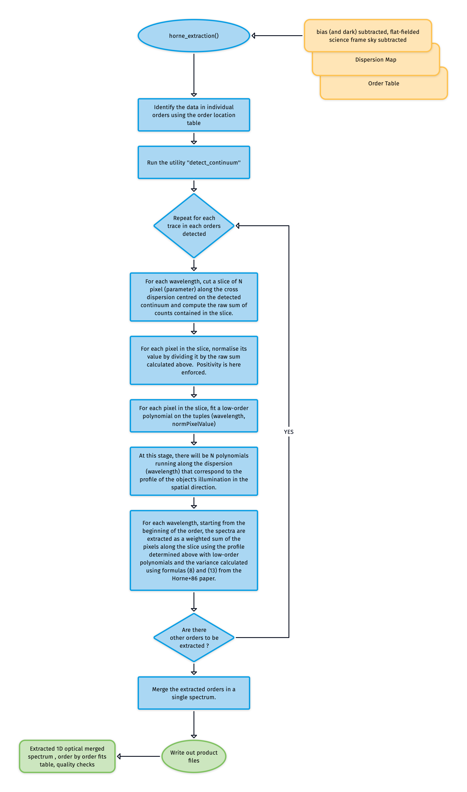

# horne_extraction

DAVE WAS HERE

The [`horne_extraction`](#soxspipe.commonutils.horne_extraction) utility performs an optimal extraction of a source's flux from an echelle order using the algorithms reported in {cite:t}`horne1986`.

:::{figure-md} horne_extraction_util
{width=600px}

The algorithm used to optimally extract an object spectrum.
:::

This utility, according to the prescription of {cite:t}`horne1986`, follows those basic steps:

### 1 Determination of the spatial profile

Starting from the order_table computed by the `detect_continumm` utility, the horne_extraction utility runs along the spectral direction and takes, for each wavelength centred in the position measured by the detect_continuum utility, a window of 1x`horne-extraction-slit-length`. Then, the pixels are summed, and each pixel in the slice is normalized as 

$$
pixel_i = \frac{Flux_{pixel_i}}{\sum_{j=0}^{N}{Flux_{pixel_j}}}
$$

where N = `horne-extraction-slit-length`.

The flux is normalised for each cross-dispersion slice to . Then, multiple parallel polynomials are fitted, and outliers are removed using an iterative fitting procedure. Bad pixels are masked. The final flux for each cross-dispersion slide is a weighted sum, as reported in Horne, with the bad pixels and outliers accounted for.

Then, a low-order polynomial is fitted for each pixel in the slice (multiple parallel polynomials), modelling the value of the fractional flux received along the dispersion axis. During the iterative fitting procedure, bad pixels are masked and outliers (CRHs etc) are removed. The complete set of polynomials represents the object's profile along the spatial direction for each wavelength. For a slice length of N pixels, there will be N different polynomials, one per pixel.

Polynomials are fitted with subsequent iterations. Pixels for which residuals deviate more than the `horne-extraction-profile-clipping-sigma` standard deviation are removed before attempting a new fitting of the data. The procedure is repeated for a maximum of `horne-extraction-profile-clipping-iteration-count` times.

When the procedure above is completed, the actual extraction occurs as follows:

### 2 Extraction of the spectrum for each wavelength for each order.

Using the polynomials computed above, the extracted integrated flux for each wavelength in the order is calculated as follows:

$$
extractedFlux_{\lambda} = \frac{\sum_{i = 0}^{N}{P_{i}^{\lambda} (D_{i}^{\lambda} - S_{i}^{\lambda})}}{\sum_{i = 0}^{N}{(P_{i}^{\lambda})^2 (V_{i}^{\lambda})^{-1}}}
$$

Where $P_{i}^{\lambda}$ is the value of the polynomial for the pixel $i^{th}$ evaluated at wavelength $\lambda$, $D_{i}^{\lambda}$ is the raw pixel value on the 2D image, detrended and sky subtracted, of the science object and $S_{i}^{\lambda}$ is the estimated value, at the same pixel position, of the 2D image of the sky model computed in stare mode. When this utility is applied to nodding or offset mode images, this value is chosen to be zero. $V_{i}^{\lambda}$ is the so-called variance image and is computed as 

$$
V_{i}^{\lambda} = V_{0} + \frac{P_{i}^{\lambda} f_{\lambda} +  S_{i}^{\lambda}}{Q}
$$

Where $V_{0}$ is the square of the readout noise of the detector, $f_\{lambda}$ is the sum of the pixels within the extraction window at each wavelength, and $Q$ is the detector gain. 

Cosmic rays and uncorrected deviant pixels are removed from the extraction by comparing their value with a certain threshold. In particular, for each pixel $i$ in the extraction window the quantity

$$
\frac{(D_{i}^{\lambda} - P_{i}{\lambda} f_{\lambda} - S_{i}{\lambda})^2}{V_{i}^{\lambda}}
$$

is computed. The extraction does not include pixels for which this quantity exceeds the `horne-extraction-profile-global-clipping-sigma`. 

The final flux for each cross-dispersion slice is a weighted sum, as reported in {cite:t}`horne1986`, with the bad pixels and outliers accounted for. Note, if more than 3 bad/outlying pixels are found within a cross-dispersion slice, then the slice is ignored.

### 3 Merging of spectral orders

The spectrum is extracted on each order separately. When all orders are extracted, they are merged together in a single spectrum. Since regions of different orders overlap in the wavelength space, they are first rectified on a common, equally spaced wavelength grid in order to merge together. Flux during resampling is conserved. 

### Utility API

:::{autodoc2-object} soxspipe.commonutils.horne_extraction.horne_extraction
:::
