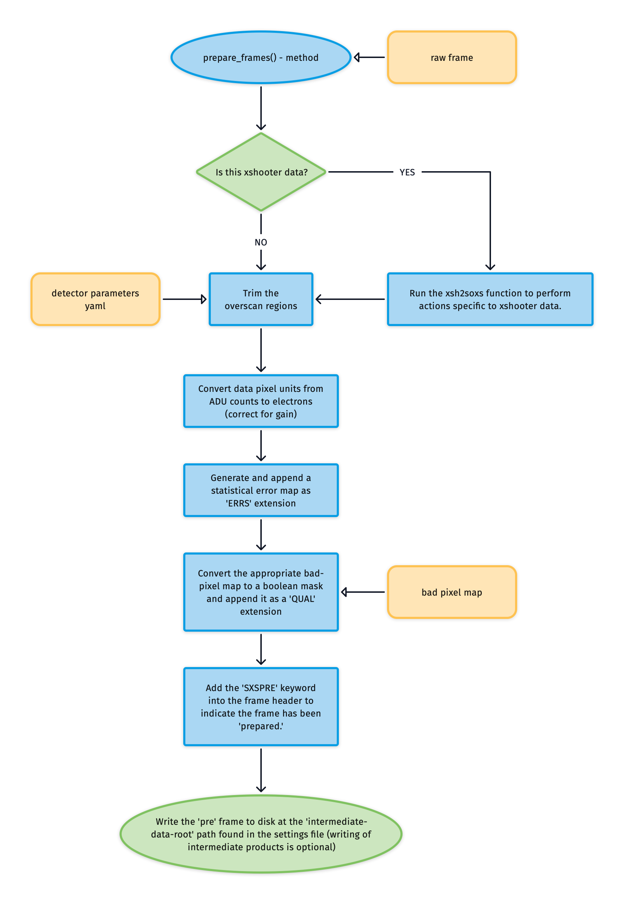
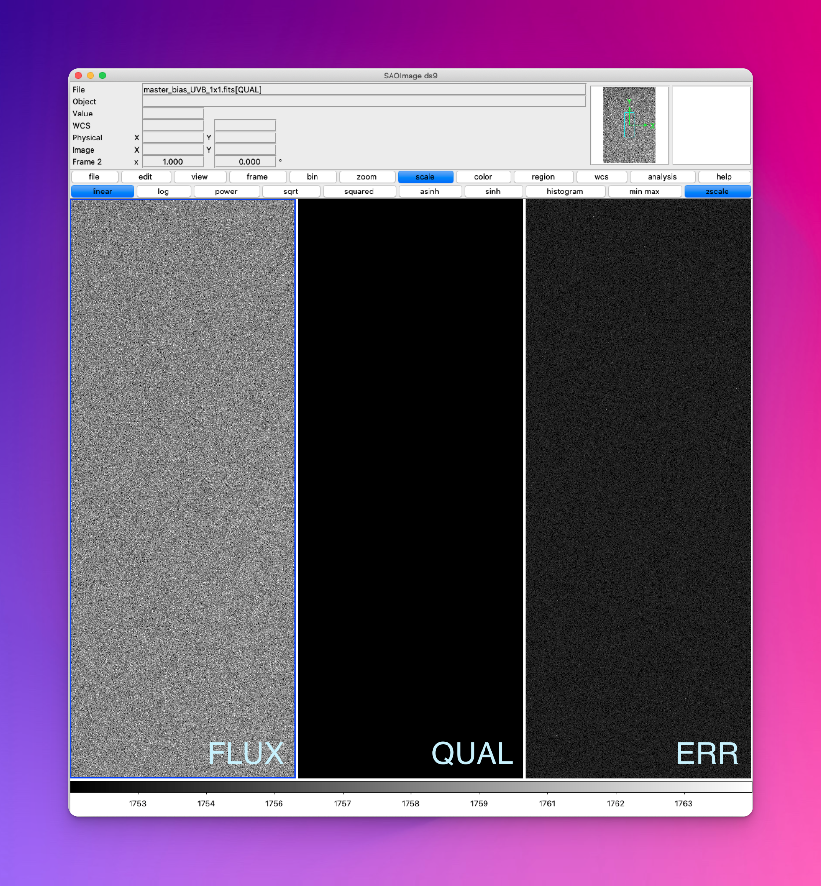

# `prepare_frames`

The purpose of [`prepare_frames`](#soxspipe.recipes.base_recipe.base_recipe.prepare_frames) is to prepare the raw SOXS frames for data reduction by trimming the overscan regions, converting the data count unit to electrons amd assigning an initial error map and bad-pixel maps.

Here's the typical workflow for preparing the raw frames:

:::{figure-md} prepare_frame_util
{width=600px}

The algorithm used to prepare raw frames for data-reduction.
:::

**1. Trim Overscan**

The first thing we need to do is trim off the overscan area of the image. The science-pixel regions for the detectors are read from the [Detector Parameters](../files/detector_parameters.md) file.

**2. ADU to Electrons**

Next the pixel data is converted from ADU to electron counts by multiplying each pixel value in the raw frame by the detector gain (the gain is read in units of electrons/ADU).

$$\rm{electron\ count} = \rm{adu\ count} \times \rm{gain}$$

**3. Generating an Uncertainty Map**

Next an uncertainty map is generated for the raw image and added as the 'ERR' extension of the image.

<!-- For each pixel the uncertainty is calculated as:

$$\rm{error} = \sqrt{\rm{readnoise}^2+\rm{electron\ count}^2}$$ -->

<!-- **Bitmap Extension**

The appropriate bitmap extension is selected and simply added as the 'FLAG' extension of the frame. -->

**4. Bad Pixel Mask**

The default detector bitmap is read from the static calibration suite and converted to a boolean mask, with values >0 becoming TRUE to indicate these pixels need to be masks. All other values are set to FALSE. This map is add as the 'QUAL' extesion of the image. 

Finally the prepared frames are saved out into the intermediate frames location with the prefix `pre_`.

Viewing the image in DS9 (using the command `ds9 -multiframe -tile columns pre_filename.fits` to show all extensions as tiled frames) we can see the 'FLUX', 'QUAL' and 'ERR' extensions are now all present.

:::{figure-md} image_extensions
{width=600px} 

Each prepared frame has data (FLUX), bad-pixel mask (QUAL) and uncertainty map (ERR) extensions. 
:::

:::{autodoc2-object} soxspipe.recipes.base_recipe.base_recipe.prepare_frames
:::

