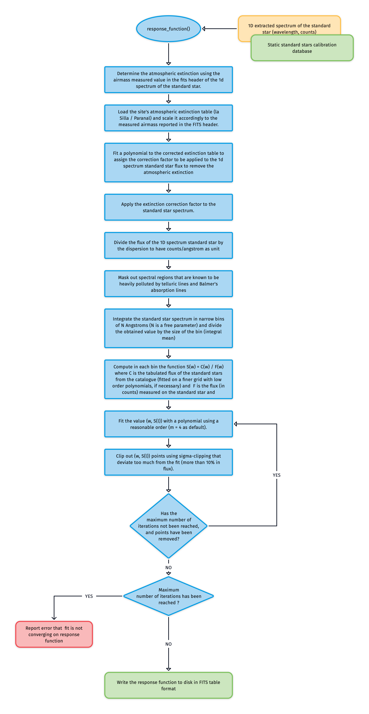

# response_function

The [`response_function`](#soxspipe.commonutils.response_function) utility computes the spectrograph's response function, using an observation of a suitable bright standard star. The function computed by this utility is used to flux calibrate the scientific spectra, converting from ADU to $erg$ $cm^{-2} s^{-1} A^{-1}$.

The general algorithm and steps performed by [`response_function`](#soxspipe.commonutils.response_function) are reported in the {numref}`response_function_util`.

:::{figure-md} response_function_util
{width=600px}

The algorithm used to compute the response function of the spectrograph.
:::

In detail, this utility first determines the average airmass at which the standard star, provided as input, has been observed. Then, it loads the standard extinction curve, supplied as a FITS table with wavelength and $mag_{airmass}$ for the observing site (La Silla for NTT/SOXS), and corrects the observed flux (in counts) accordingly, applying the formula:

$$
fluxCorrected_{\lambda} = fluxObserved_{\lambda} \times 10^{AM \times mag_{airmass}}
$$

Please note that the tabulated extinction curve and the observed spectrum are fitted with a nearest-neighbour interpolation schema to cope with the different discretisations.

The $fluxCorrected_{\lambda}$ values are then converted in $ADU$ ${A}^{-1} s^{-1}$ by diving for the value contained in the `EXPTIME` keyword of the standard star spectrum and for the dispersion measured at each pixel. According to the considered arm (UV-VIS, NIR), regions that are known to be polluted by significant telluric absorptions or strong Lyman or Balmer/Paschen lines are masked out.

The observed standard star spectrum is then averaged in narrow bins of about 10 $A$ to increase the signal-to-noise ratio (a sort of narrow-band photometry). Then, from the tabulated value of the standard star catalogue (interpolated on a suitable grid), the function:

$$
S(\lambda) \propto \frac{C(\lambda)}{F(\lambda)}
$$

where $C(\lambda)$ is the tabulated value of the standard star flux in the catalogue (in $erg$ $cm^{-2} s^{-1} A^{-1}$), and $F(\lambda)$ is the flux (in ADU) measured on the standard star.

The different values of $S(\lambda)$ are fitted with a polynomial of 4th order (as default) or `soxs-response-poly_order` using a standard iteration schema. For each iteration, data are fitted, and points for which the residuals deviate more `soxs-response-sigma_clipping_threshold` standard deviations are clipped for the next iteration (with a maximum of `soxs-response-max_iteration` number of iterations).

If the fit does not converge, `response_function` raises an exception; otherwise, a FITS table containing the fit's parameters is saved.

### Utility API

:::{autodoc2-object} soxspipe.commonutils.response_function.response_function
:::
