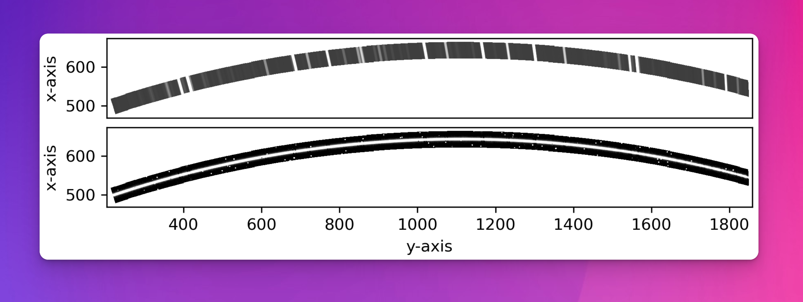

# subtract_sky

The [`subtract_sky`](#soxspipe.commonutils.subtract_sky) utility uses the on-frame data provided in a two-dimensional spectral image to accurately model the sky background, which is removed from the original data frame.

The Kelson Background Subtraction method, initially outlined in {cite:t}`kelson2003`, attempts to make optimal use of all data provided in a two-dimensional spectral image to accurately model a sky background image, which can then be removed from the original data frame. The method allows sky-subtraction to be performed in the early stages of the data-reduction process (just after flat-fielding) with no need first to identify and isolate cosmic-ray hits or other bad-pixel values.

:::{figure-md} subtract_sky_util
:target: sky_background_subraction.png
{width=600px}

The algorithm used to model and subtract the sky-flux from data taken in stare mode.
:::

Due to the curved format of each order (at least in the SOXS NIR data) and the cross-dispersion tilt of the skylines, each pixel measures flux at a slightly different wavelength to its neighbours. This provides us with an over-sampled spectrum of the sky.

The first step is to assign a wavelength, slit position and echelle order number to each detector pixel via the 2D dispersion map. Next, we flatten the data for each order to provide the over-sampled, wavelength-sorted flux array. 

An iterative rolling-window percentile smoothing with 𝜎-clipping flags pixels significantly brighter than the underlying sky flux (see {numref}`percentile_smoothing` and {numref}`percentile_smoothing_zoom`). These flagged pixels will contain cosmic-ray hits and pixels with source flux. {numref}`object_clipped_image` shows the locations of these flagged pixels on the original detector plane; the trace of the object has been successfully masked. The settings to tune this percentile clipping are  `percentile_rolling_window_size`, `percentile_clipping_sigma`, and `percentile_clipping_iterations`. 

:::{figure-md} percentile_smoothing
:target: ../_images/image-20240919131037029.png

The narrow spikes seen in the original data (grey) represent the cosmic ray hits and other bad-pixel values contaminating our measurements of the background night sky. The blue line is the percentile smoothed data (a close approximation to the sky spectrum), and the faint blue crosses are pixels flagged as containing flux other than just the sky.
:::

:::{figure-md} percentile_smoothing_zoom
:target: ../_images/image-20240919131221006.png

A zoom of the figure above. Pixels containing object flux are seen to contain flux above the background sky.
:::

:::{figure-md} object_clipped_image
:target: ../_images/image-20240919134124789.png

The original echelle order with pixels flagged as containing object flux or cosmic-ray hits marked in blue.
:::

Next, an initial univariate bspline is fitted to the order's wavelength-sorted array of sky-flux (with contaminated pixels removed). Each pixel flux used in the bspline is weighted with its associated uncertainty, and a set of evenly spaced knots are employed. The order of the bspline is defined by `bspline_order`. Residuals between the bspline fit and the original data are calculated, and the most deviant pixels are iteratively clipped (`bspline_fitting_residual_clipping_sigma` and `bspline_iteration_limit`).

Using the first and second derivatives of the bspline fit, those pixels associated with prominent skylines are flagged. Pixels *not* associated with prominent skylines are used to calculate a 'residual floor'. This is defined at a percentile (`residual_floor_percentile`) of the residuals in this set of non-sky-line data. For each group of pixels found between adjacent knots, if the mean residuals are above the residual floor, a new knot is positioned at the wavelength found at the mid-point of the two original knots. Extra knots are also added at the mid-points between adjacent knots on the wings of prominent skylines (where the sky-flux change is sharpest). 

A bspline is refitted to the order's wavelength-sorted sky-flux array using the updated knot set, and residuals are recalculated.

At this stage, all the residuals are sorted by slit-position, and a low-order polynomial with order `slit_illumination_order` is fitted to the residuals. If illumination is not constant along the length of the slit, this polynomial will fit the profile of that inconsistency. This slit illumination profile is subtracted from the original pixel flux.

A final round of iterative bspline fitting is performed, each time adding new knots at locations where the residuals exceed the residual floor determined earlier and at the wings of prominent skylines. This continues until the bspline fitting iteration limit (`bspline_iteration_limit`) is reached. {numref}`bspline_fit` shows the final bspline fit that is used as the sky model.

:::{figure-md} bspline_fit
:target: ../_images/image-20240920100928141.png

A bspline fit of the sky spectrum. The black dots are the sky flux values coming from individual pixels, the red diamonds are the strategically placed knot, and the blue line is the final bspline fit to the data (the sky model).
:::

Finally, this bspline fit is used to generate an estimation of the sky flux level in every pixel in the original detector space (top panel of {numref}`sky_model_image`), which is then subtracted from the original image to produce a sky-subtracted frame ready for object extraction.

:::{figure-md} sky_model_image
:target: ../_images/image-20240920101017782.png

The bspline fit is used to estimate the sky flux level in every pixel in the original detector space (top panel), which is then subtracted from the original image to produce a frame with the sky removed (bottom panel). The object trace can be clearly seen now the skylines have been removed.
:::

:::{bibliography}
:filter: docname in docnames
:::

## Utility API

:::{autodoc2-object} soxspipe.commonutils.subtract_sky.subtract_sky
:::

